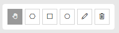
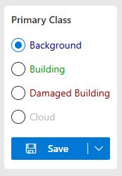
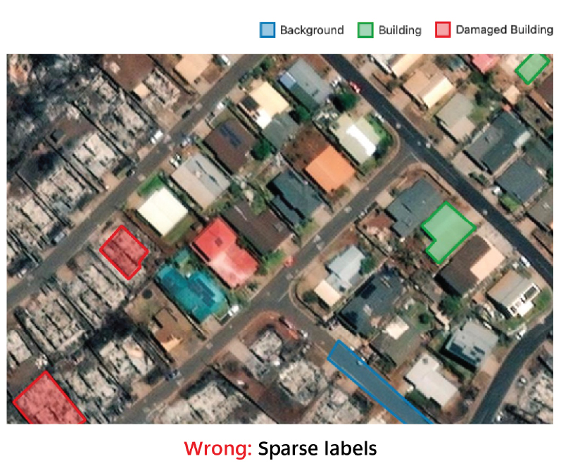
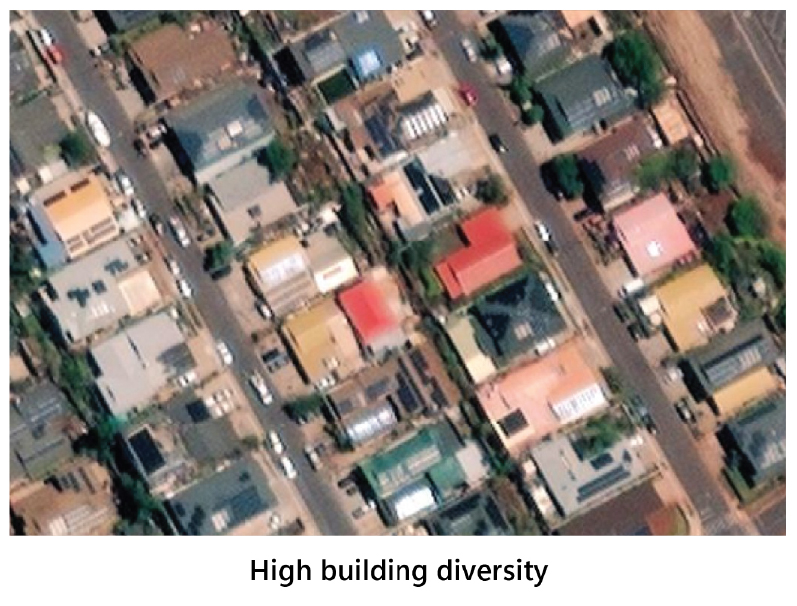
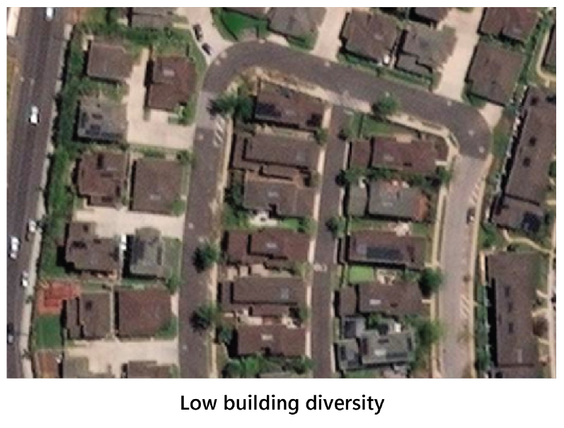
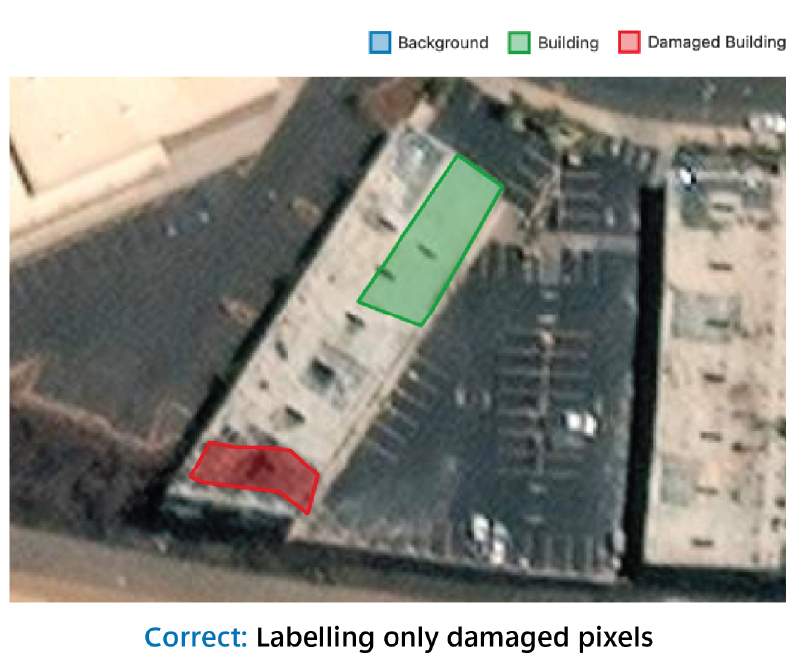
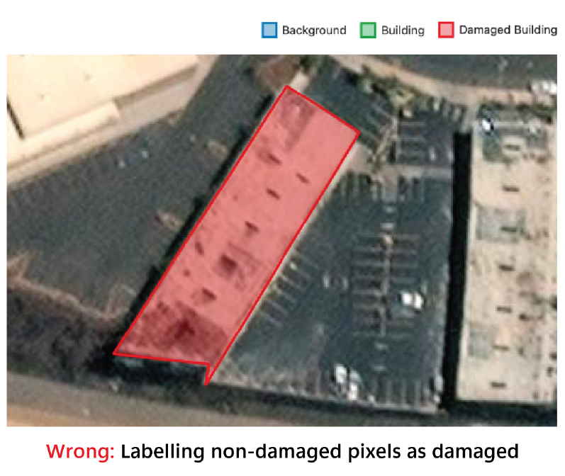

<!-- SOURCE OF TRUTH: This page duplicates the in-app Help Docs
     (ui/src/Components/HelpDocs/HelpDocsLabeling.jsx). Keep the two in sync
     until the content is consolidated to a single source. -->

# Labeling

Labeling refers to manually annotating damaged areas, undamaged areas, and background
areas on a sub-section of satellite imagery. These labels are what the model will use to
train itself and generate damage predictions over the rest of the image.

This is a required step before any model training or inference can be run.

## Labeling Tool

### Launching the labeling tool

To launch the labeling tool, go to the Projects page and click the **Launch** button
next to the image layer that you wish to run assessment on.

### Imagery Properties

This panel allows you to adjust the visual properties of the pre- and post-event imagery
to improve clarity or highlight specific features. The available controls are:

- **Opacity:** Adjusts the transparency of the map layer. Slide left to make the layer
  more transparent; right to make it more opaque.
- **Contrast:** Changes the difference between light and dark areas in the image.
  Increasing contrast can make features stand out more clearly.
- **Hue Rotation:** Rotates the color spectrum of the image. Useful for visually
  distinguishing features when natural colors are not sufficient.
- **Saturation:** Controls the intensity of colors. Lower saturation results in more
  grayscale images; higher saturation produces more vivid colors.
- **Reset Controls:** Resets all sliders to their default values.

**Imagery toggle:** Click the toggle to switch between post-event and pre-event imagery.
If you did not upload pre-event imagery, the tool will default to the Azure Basemap. You
can also use the keyboard shortcut `Ctrl+Alt+C`.

Use these controls to optimize the map view for your labeling tasks or analysis needs.

### Drawing Tools

Use these tools to create and manage geometric annotations on the map. Each button
allows you to switch between interaction modes:

- **Pan Tool (hand icon):** Enables map navigation. Use this mode to move the map
  without editing any features.
- **Polygon Tool (hexagon icon):** Draw custom polygons by clicking multiple points on
  the map. Useful for irregular areas.
- **Rectangle Tool (square icon):** Draw rectangular shapes by clicking and dragging.
- **Circle Tool (circle icon):** Draw circular shapes by clicking and dragging from the
  center outward.
- **Edit Tool (pencil icon):** Select and modify existing shapes. You can move vertices
  or reshape the geometry.
- **Delete Tool (trash icon):** Remove selected annotations from the map.

### Switching between label classes

Switch between label classes here. You must select a tool as well as a class to draw a
label.

### Saving Labels

Click **Save** to save all labels drawn so far. Alternatively, click the down arrow next
to **Save** to save labels and initiate model training in one click.

## Tips for Effective Labeling

### Minimum number of labels

Draw at minimum 5–10 labels for each class. Model training gets more effective with more
quantity and quality of labels. 70–100 make for a good training set. More than 150
labels are not necessary.

### Cluster labels closely

Label features that are directly adjacent to each other. For example, if you are
labeling a building, then label the background area around it as well. This is important
because unlabeled areas are not used in training the model — therefore if you label a
building but do not label around it, the model will not be penalized for making a large
blurry prediction around the building (versus a precise prediction that follows the
lines of the building). The following images illustrate a good and bad example of dense
clustered labeling:

| Correct | Incorrect |
|---------|-----------|
|  |  |

### Draw labels precisely

Labeling features with high precision is more important than rapidly labeling large
areas with low precision. The following images illustrate a good and bad example of high
precision labeling:

| Correct | Incorrect |
|---------|-----------|
|  |  |

### Maximize label diversity

Label diverse features. For example, labeling 20 identical-looking buildings is less
useful to model training than labeling 20 buildings with varying roof colors, sizes, and
textures. The following images illustrate high and low diversity of labels:

| High diversity | Low diversity |
|----------------|---------------|
|  |  |

### Label relevant portions only

Buildings can have mixed labels — e.g., a partially damaged building will have some
pixels representing the damaged class while other pixels will not. When labeling, only
assign the damaged pixels to the damaged class, as opposed to the whole building. The
following images illustrate a good and bad example of labeling relevant portions:

| Correct | Incorrect |
|---------|-----------|
|  |  |
