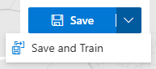
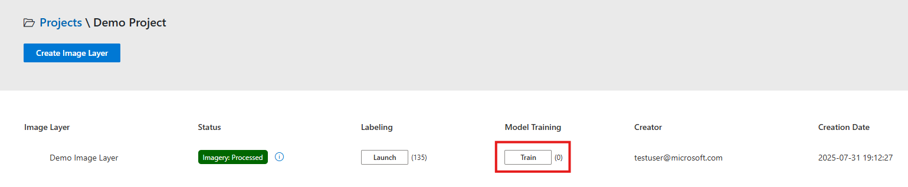

<!-- SOURCE OF TRUTH: This page duplicates the in-app Help Docs
     (ui/src/Components/HelpDocs/HelpDocsModelTraining.jsx). Keep the two in sync
     until the content is consolidated to a single source. -->

# Model Training

There is generally a large amount of variation in satellite imagery from one
geographical region to the next, and training results can rarely be applied from one
region to the next without a lot of re-training.

To ensure good quality results, HASTE works by training the model afresh in each
training run.

(train-a-new-model)=
## Train a new model

Training a model requires that a minimum amount of manual labeling be done on the image
layer. Refer to the [Labeling](labeling.md) section for tips on effective labeling.

Once you have created labels, you can train a model in two ways:

1. By clicking **Save and Train** in the labeling tool itself.

   

2. Or by clicking the **Train** button for that image layer on the Projects page.

   

### Model Training parameters

Various parameters can be changed to train the model with fine-grained control. If
you're not sure what values to use, leave them at their default values.

- **Model Name:** A unique name for your model.
- **Base Model:** The base model from the model catalog that will be fine-tuned with
  your data. Only models whose project event type and image layer source match your
  project and image layer are shown. This will be disabled if no matching models are
  available.
- **Learning Rate:** The learning rate for the training process. This controls how much
  to change the model in response to the estimated error each time the model weights are
  updated.
- **Batch Size:** The number of training examples utilized in one iteration. A larger
  batch size can lead to faster training but requires more memory.
- **Max Epochs:** The number of times the learning algorithm will work through the
  entire training dataset.
