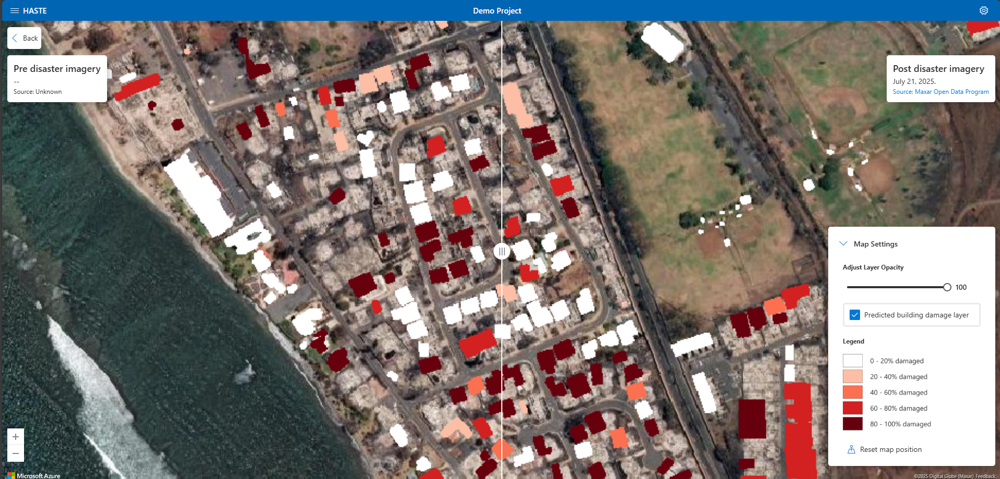
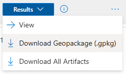
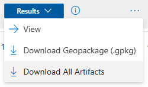

<!-- SOURCE OF TRUTH: This page duplicates the in-app Help Docs
     (ui/src/Components/HelpDocs/HelpDocsResults.jsx). Keep the two in sync
     until the content is consolidated to a single source. -->

# Results

HASTE generates various types of damage assessment results. They are explained in detail
in the sections that follow.

## Built-in Visualizer

This opens a damage visualizer tool within HASTE. It is useful for quickly visualizing
damage predictions, comparing them with pre-event imagery, and for sharing these results
via screenshots.

## Downloadable Artifacts

### Predictions as a geopackage

The predicted damage layer is downloadable as a geopackage file (`.gpkg`) that can then
be integrated into other geospatial visualization tools, such as ArcGIS, QGIS, etc.

### Intermediate Outputs

All intermediate outputs — such as the saved labels, training checkpoint files,
downloaded building footprints, and predictions — can be downloaded as a zip file. This
is useful for troubleshooting training failures.

